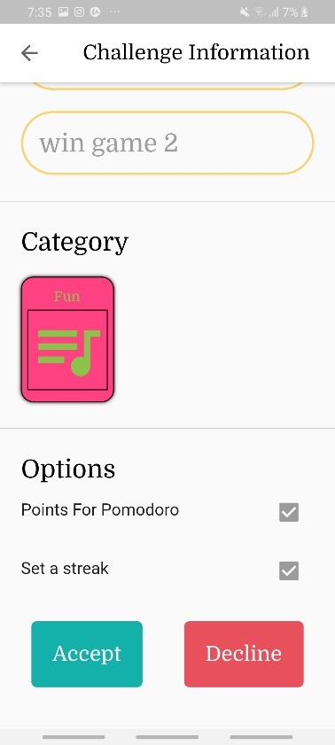

# **Pomocheck**

Pomocheck is an application that revolves around solving the lack of motivation and procrastinating that most youth struggle with when they are trying to achieve their goals. It uses the Pomodoro technique combined with other techniques that gamify the whole task checking process. It lets you add up your friends and challenge them on your common goals/ projects. This was built using flutter and firebase to store information. **The application was a 3 day hackathon build.**

**How to use the application**

This is a guide of how you can use the application/ further understand it.

**Sign-Up**

**Log-In**

**Chats Screen:**
Press on username to chat with them, so you can talk about your challenges or press on challenge me to set up a challenge.

**Set up a challenge screen:**
Choose title, subtasks and if you want to turn on points based on finishing pomodoro intervals.

**Pending challenges screen:**
The challenges which have been set up but not yet approved. When &quot;sent by me&quot; is shown it means that it has been sent to the other user but not yet accepted/ declined. When &quot;read more&quot; button is shown it means that the other user has sent you a challenge, press read more to see all the details.

**Read more screen:**
A screen to see a received challenge details and to accept or decline incoming challenges.

**Ongoing challenges screen:**

A screen to see the ongoing challenges and your progress in them (percentage of subtasks you have checked off). when see progress/ tile is pressed, you can see your progress compared to your friend&#39;s and how many points you gained. You can check off subtasks from there or start a pomodoro interval.

When &quot; my progress screen&quot;is pressed you navigate to the see progress screen:
You gain 12 points if you check off a subtask before your friend, and 10 if you are the second to check them off. You gain 25 points if you finish a pomodoro interval. If you do not finish it, you lose an amount of points equal to the minutes left in the timer.

**Pomodoro timer screen:**
If you exit before timer is finished you lose points, otherwise you gain points.

**Their progress screen:**
A screen to see how your opponent is doing.

**Finished challenges screen:**
Is there for you to see the challenges you have completed and their status. There are for statuses:

&quot;set dare&quot; : for when you win a challenge but you still did not send your opponent a dare.

&quot;dare delivered&quot;: for when you win a challenge and the dare is delivered to your oponnent.

&quot;dare pending&quot;: for when you lose a challenge and the dare is not yet sent to you.

&quot;take dare&quot; : for when you lose a challenge and you receive the dare.

**Set dare screen:**
For when you win a challenge and you want to send a dare to your opponent.

**Take dare screen:**
for when you lose a challenge and you want to see the dare sent to you.

**Search page to search for other users and add them as a friend:**

**You lost screen:**
For when you press on dare pending in the finished tab.

**You won screen:**
For when you press on dare delivered in the finished tab.

Note: The app was run on a nexus 6 emulator.
**And that is it! Thank you for reading.**
